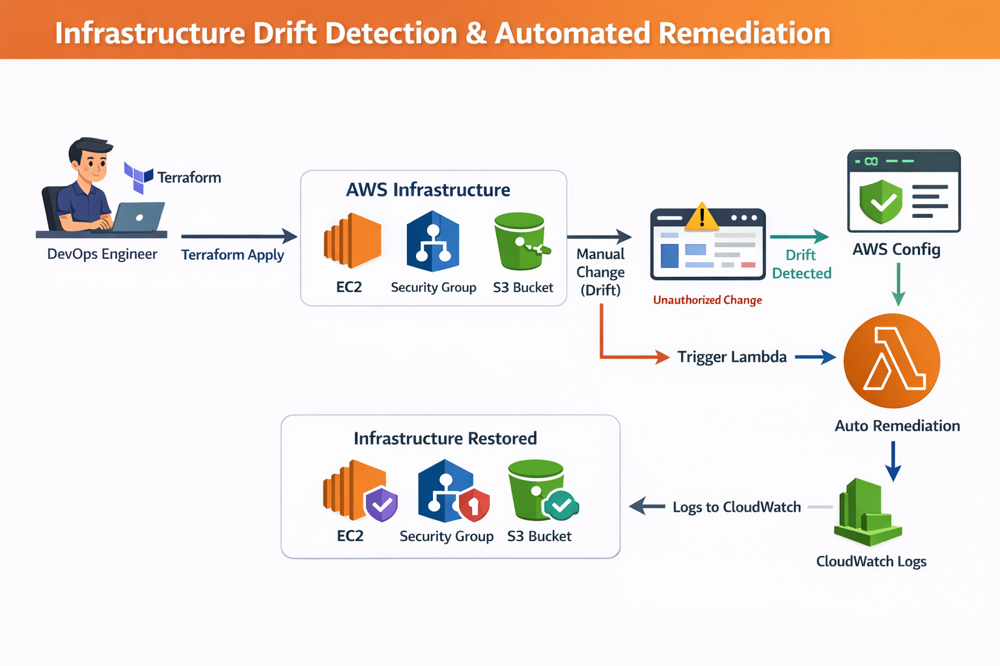

# Infrastructure Drift Detection and Automated Remediation using Terraform and AWS Lambda
## Project Overview
In modern cloud environments, organizations follow Infrastructure as Code (IaC) to manage infrastructure using tools like Terraform. However, engineers sometimes make manual changes directly from the AWS Console, which leads to configuration drift.

Configuration drift occurs when the actual infrastructure state differs from the Terraform-defined state.

This project demonstrates how to:
* Detect infrastructure drift
* Automatically remediate the drift
* Restore infrastructure to the approved Terraform state

The system uses Terraform, AWS Config, AWS Lambda, and CloudWatch Logs to build an automated drift detection and remediation workflow.

---
### Problem Statement

Organizations enforce Infrastructure as Code policies, but manual changes made in the AWS Console can cause inconsistencies.

**Example:**

Terraform Configuration:
* Security Group allows **Port 80**

Manual Change:
* Engineer adds **Port 22**

This results in **Infrastructure Drift.**

The system must:
1) Detect the drift
2) Automatically restore the infrastructure to the correct Terraform state

---

## Architecture



---

## Technologies Used

| Technology         | Purpose                     |
| ------------------ | --------------------------- |
| Terraform          | Infrastructure provisioning |
| AWS EC2            | Compute instance            |
| AWS Security Group | Network access control      |
| AWS S3             | Storage resource            |
| AWS Lambda         | Automated remediation       |
| AWS Config         | Drift detection             |
| CloudWatch Logs    | Logging and monitoring      |
| AWS CLI            | Infrastructure interaction  |

---
### Infrastructure Provisioned using Terraform
The following resources are created using Terraform:
* EC2 Instance
* Security Group
* S3 Bucket


Example Terraform Resources:
* `aws_instance `
* `aws_security_group `
* `aws_s3_bucket `

---
## Project Setup
 **1. Clone the Repository**
```
git clone https://github.com/your-username/terraform-drift-detection.git
cd terraform-drift-detection
```
**2. Install Terraform**
```
wget https://releases.hashicorp.com/terraform/1.7.5/terraform_1.7.5_linux_amd64.zip
unzip terraform_1.7.5_linux_amd64.zip
sudo mv terraform /usr/local/bin/
```
Check version:
```
terraform --version
```


**3. Install AWS CLI**
```
curl "https://awscli.amazonaws.com/awscli-exe-linux-x86_64.zip" -o "awscliv2.zip"
unzip awscliv2.zip
sudo ./aws/install
```
Verify:
```
aws --version
```
**4. Configure AWS CLI**
```
aws configure
```
Enter:
```
AWS Access Key
AWS Secret Key
Region: ap-south-1
Output: json
```
---

### Deploy Infrastructure
Initialize Terraform:
```
terraform init
```


Check execution plan:
```
terraform plan
```
Deploy infrastructure:
```
terraform apply
```


Resources created:
* EC2 Instance
* Security Group
* S3 Bucket

---
### Simulating Infrastructure Drift
To simulate drift:
1) Go to AWS Console
2) Open Security Groups
3) Select the Terraform-created security group
4) Add a new rule:
```
Port 80 (HTTP)
Source: 0.0.0.0/0
```


5) Modify EC2 tag from:
```
Environment = prod
```


to 
```
Environment = dev
```


This creates Configuration Drift.

---
### Detecting Drift
Run:
```
terraform plan
```
Terraform will detect the drift and show differences between:
* Current infrastructure
* Terraform configuration

Example output:
```
~ security_group rule changed
~ EC2 tag modified
```

---
### Automated Drift Detection

AWS Config continuously monitors infrastructure resources and detects configuration changes such as:
* Security group rule modification
* EC2 configuration changes


.png)

When drift is detected, AWS Config triggers the remediation workflow.

---
### Lambda Auto Remediation


An AWS Lambda function is used to automatically restore infrastructure to the Terraform-defined state.

Lambda workflow:
```
Drift Detected
       │
       ▼
Lambda Triggered
       │
       ▼
Execute Terraform Apply
       │
       ▼
Infrastructure Restored
```


Example Lambda Logic:
* Detect drift event
* Execute remediation process
* Log activity to CloudWatch

---
### Logging and Monitoring

All events are logged in:

**Amazon CloudWatch Logs**


Logs include:
* Drift detection events
* Lambda execution logs
* Remediation status

Example log:
```
Drift detected
Running remediation
Infrastructure restored successfully
```
---
### Proof of Drift Detection
The following evidence is captured:
1) Terraform infrastructure deployment
2) Manual modification of security group rule
3) Terraform plan showing drift
4) Lambda execution logs
5) Infrastructure restored automatically

---
## Key Learning Outcomes

This project demonstrates:
* Infrastructure as Code using Terraform
* Cloud configuration monitoring
* Automated infrastructure remediation
* Serverless automation using AWS Lambda
* Cloud monitoring using CloudWatch

---
## Conclusion

This project provides a practical implementation of Infrastructure Drift Detection and Automated Remediation using Terraform and AWS services.

By combining AWS Config, Lambda, and Terraform, organizations can ensure that their infrastructure remains consistent with the approved Infrastructure as Code configuration.